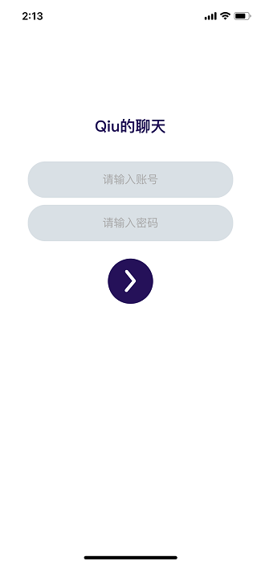
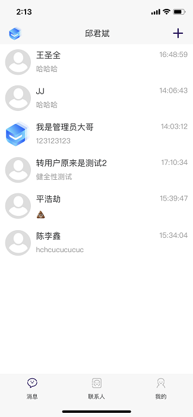
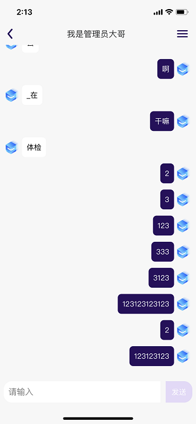
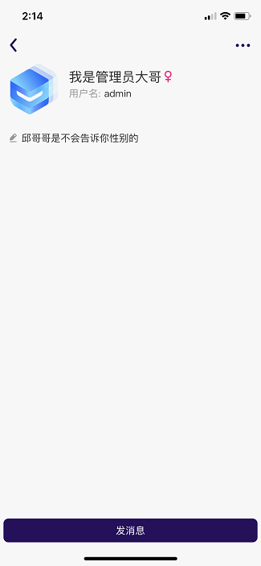

# private-chat-client

#### 介绍

想要运行项目，建议先了解uniapp运行编译流程。

这是个仿qq的聊天软件,前端技术使用的是uniapp，安卓端与ios端样式都做了兼容。后端代码请跳转到另一个[代码仓库（https://gitee.com/private-chat/private-chat-server）](https://gitee.com/private-chat/private-chat-server)

目前该项目已经完成了点对点的实时聊天以及实时的好友添加

#### 项目依赖安装

下载编译器hbuilderx 

在hbilderx里安装sass插件

#### 项目配置

###### 安卓端与ios端运行配置：

config/base/config-info.js 文件里更改配置，配置文件的属性已经加上了对应注释。

###### H5端运行配置：

manifest.json 文件里拉到最后面，更改h5->devServer->proxy->/api->target属性，该属性对应着url地址

#### 效果截图

#### 后续开发目标

1. 注册/用户信息编辑功能
2. 可发送表情/图片
3. 群聊功能
4. 消息推送（既消息通知）

